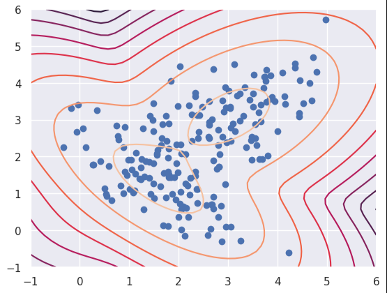
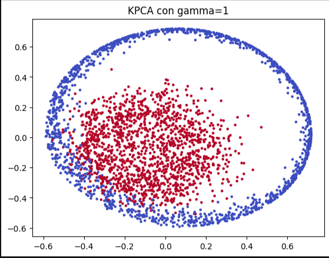

# Macroentrenamiento en Inteligencia Artificial

Repositorio central de materiales, prácticas y soluciones para el curso de especialización en Minería de Datos y el reto de Procesamiento de Lenguaje Natural (NLP).

## Estructura del Proyecto

El repositorio está organizado en dos módulos principales correspondientes a las áreas de estudio del curso.

### 1. Minería de Datos
Directorio: `Mineria_de_datos/`

Este módulo contiene implementaciones de algoritmos de aprendizaje supervisado y no supervisado, así como pipelines de procesamiento de datos.

* **Contenido Técnico:**
    * **Preprocesamiento:** Limpieza de datos, detección de anomalías y manejo de valores faltantes.
    * **Aprendizaje Supervisado:** Regresión (Lineal, Polinomial, Logística), SVM, KNN, Naive Bayes y XGBoost.
    * **Aprendizaje No Supervisado:** K-Means, K-Modes, DBSCAN, GMM y Agrupamiento Jerárquico.
    * **Reducción de Dimensionalidad:** PCA, KernelPCA y LDA.
* **Organización:**
    * `notas/`: Jupyter Notebooks con la teoría y ejemplos de implementación.
    * `practicas/`: Evaluaciones prácticas (q1 a q5).
    * `dataSets/`: Fuentes de datos (CSV, NPY) utilizadas en los ejercicios.

<div style="display: flex; justify-content: space-between;">
    
    
</div>

### 2. Reto: Análisis de Sentimientos en Pueblos Mágicos
Directorio: `reto_NLP/`

Desarrollo de una solución de NLP para la clasificación de sentimientos basada en reseñas de turismo.

* **Notebook Principal:** `Resultados/Reto_primer_intento.ipynb`
* **Datos:**
    * `corpus/`: Contiene los conjuntos de entrenamiento (`MeIA_2025_train.xlsx`) y prueba.
* **Salidas:**
    * `Resultados/generados/`: Archivos CSV con polaridad aumentada y resultados de predicción del equipo.

## Instalación y Dependencias

El proyecto requiere Python. Las librerías necesarias para ejecutar los notebooks (pandas, numpy, scikit-learn, matplotlib, etc.) se encuentran listadas en el archivo de requisitos.

```bash
pip install -r requirements.txt
```

## Instructores

* Dr. Eduardo Espinosa Avila (Minería de Datos con Python y Altair AI Studio)

* Dr. Miguel Ángel Álvarez Carmona (Reto de Análisis de Sentimientos)
